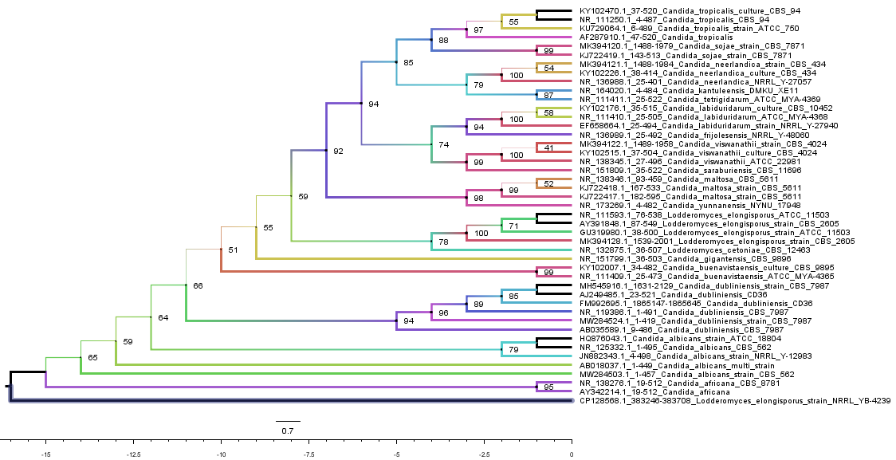
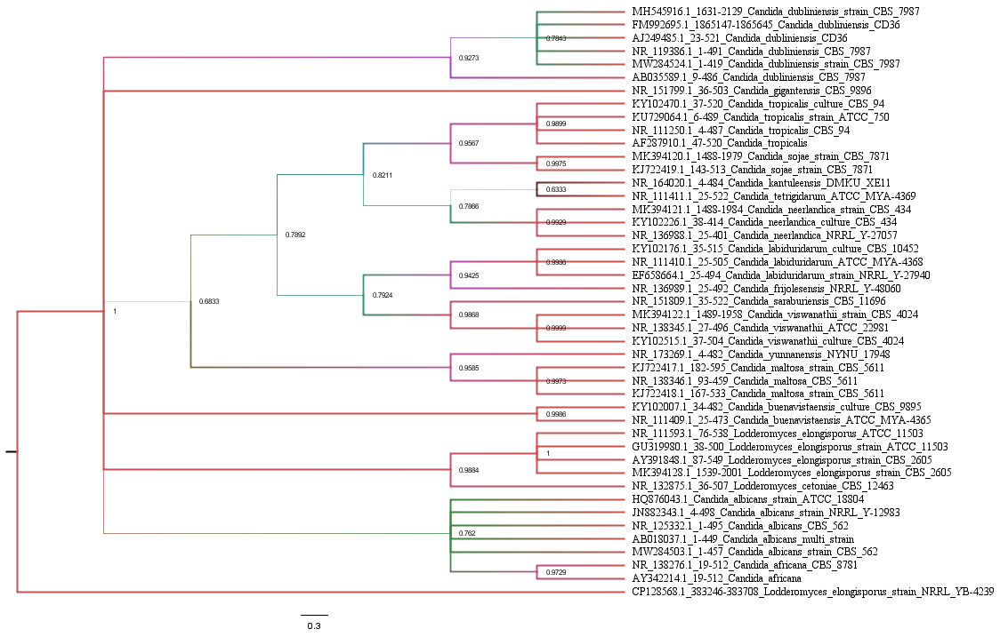

# 🧬 Phylogenetic Analysis of *Candida albicans* ITS Sequences

### Workshop Assignment — MycoAsia Journal World Fungus Day Workshop

[](LICENSE)
[](https://github.com/Nishad-Supugade/Candida-albicans-ITS-phylogenetic-analysis/commits/main)
[](https://github.com/Nishad-Supugade/Candida-albicans-ITS-phylogenetic-analysis)
[](#-analysis-workflow)

---

## 📌 About the Project

This repository documents a phylogenetic analysis of fungal ITS sequences, with *Candida albicans* as the primary organism of interest.

The project was completed as a workshop assignment for the **MycoAsia Journal World Fungus Day Workshop**. It records sequence retrieval, sequence curation, multiple sequence alignment, phylogenetic analyses, Bayesian analysis, tree visualization, and associated output files generated during the workflow.

The repository is designed as a transparent record of the practical bioinformatics workflow rather than as a standalone research publication.

## 🎯 Project Objectives

- Retrieve ITS sequences related to *Candida albicans*.
- Examine sequence similarity using NCBI BLASTn.
- Curate the retrieved sequence dataset.
- Perform multiple sequence alignment using MUSCLE through MEGA12.
- Construct an initial Neighbor-Joining (NJ) phylogenetic tree using MEGA12.
- Perform maximum-likelihood phylogenetic analysis using IQ-TREE.
- Perform Bayesian phylogenetic analysis using MrBayes.
- Visualize and format phylogenetic trees using FigTree.
- Preserve intermediate files and final outputs in a reproducible repository structure.

## 🔬 Analysis Workflow

```text
Reference ITS sequence
        ↓
NCBI BLASTn
        ↓
Sequence retrieval
        ↓
Sequence curation
        ↓
MUSCLE / MEGA12 alignment
        ↓
MEGA12 Neighbor-Joining
        ↓
   ┌────┴────┐
   ↓         ↓
IQ-TREE   MrBayes
   └────┬────┘
        ↓
     FigTree
        ↓
Final phylogenetic trees
```

## 🧪 1. Sequence Retrieval

The ITS region was selected as the molecular marker. A *Candida albicans* ITS sequence was used as the query for an NCBI BLASTn search. Relevant nucleotide hits were examined and the first 50 selected BLAST hits were collected for downstream processing.

Files:

- [`Tree_Building_mini_project_fasta_seq.txt`](01_sequence_retrieval/Tree_Building_mini_project_fasta_seq.txt)
- [`seqdump.txt`](01_sequence_retrieval/seqdump.txt)

Folder: [`01_sequence_retrieval/`](01_sequence_retrieval/)

## 🧹 2. Sequence Curation

The retrieved sequences were manually inspected and curated before alignment. Sequences considered unsuitable, including faulty and repetitive/duplicate entries identified during manual inspection, were removed from the working dataset.

Files:

- [`Tree_Building_mini_project_fasta_seq.txt`](02_sequence_curation/Tree_Building_mini_project_fasta_seq.txt)
- [`Tree_Building_mini_project_Tree_MEGA.mtsx`](02_sequence_curation/Tree_Building_mini_project_Tree_MEGA.mtsx)

Folder: [`02_sequence_curation/`](02_sequence_curation/)

## 🧬 3. Multiple Sequence Alignment

Multiple sequence alignment was performed using **MUSCLE**, implemented through **MEGA12**.

Main alignment:

[`Phylogenetic_Tree_mini_Project_Alignment.meg`](03_alignment/Phylogenetic_Tree_mini_Project_Alignment.meg)

Folder: [`03_alignment/`](03_alignment/)

## 🌳 4. Neighbor-Joining Analysis — MEGA12

An initial **Neighbor-Joining (NJ)** phylogenetic analysis was performed using MEGA12 on the curated alignment.

Output:

[`Phylogenetics_mini_Project_Tree.pdf`](04_MEGA_NJ/Phylogenetics_mini_Project_Tree.pdf)

Folder: [`04_MEGA_NJ/`](04_MEGA_NJ/)

## 🧬 5. Maximum-Likelihood Analysis — IQ-TREE

Following the initial Neighbor-Joining analysis in MEGA12, the curated alignment was further analyzed using **IQ-TREE 2**.

The analysis used:

- IQ-TREE 2
- ModelFinder for model selection
- Ultrafast Bootstrap (UFBoot)
- 1,000 bootstrap replicates

Folder: [`05_IQ-TREE/`](05_IQ-TREE/)

| File | Description |
|---|---|
| [`Phylogenetic_Tree.treefile`](05_IQ-TREE/Phylogenetic_Tree.treefile) | Maximum-likelihood tree |
| [`Phylogenetic_Tree.contree`](05_IQ-TREE/Phylogenetic_Tree.contree) | Consensus tree |
| [`Phylogenetic_Tree.iqtree`](05_IQ-TREE/Phylogenetic_Tree.iqtree) | IQ-TREE analysis report |
| [`Phylogenetic_Tree.log`](05_IQ-TREE/Phylogenetic_Tree.log) | Analysis log |
| [`Phylogenetic_Tree.splits.nex`](05_IQ-TREE/Phylogenetic_Tree.splits.nex) | Split information |

Final visualization:

[`figures/Candida_IQtree_Tree.png`](figures/Candida_IQtree_Tree.png) · [`07_FigTree/Candida_IQtree_Tree.pdf`](07_FigTree/Candida_IQtree_Tree.pdf)

## 🔵 6. Bayesian Phylogenetic Analysis — MrBayes

Bayesian phylogenetic analysis was performed using **MrBayes 3.2.7a**.

The analysis used two independent runs, with four chains per run, for **1,000,000 generations**. Samples were collected every 100 generations and the first 25% of sampled generations were treated as burn-in.

The nucleotide model specified was:

```text
lset nst=6 rates=invgamma
```

Folder: [`06_MrBayes/`](06_MrBayes/)

Important outputs:

- [`Phylogenetic_Tree_mini_Project_Alignment_fixed.nexus`](06_MrBayes/Phylogenetic_Tree_mini_Project_Alignment_fixed.nexus)
- [`Phylogenetic_Tree_mini_Project_Alignment_fixed.nexus.con.tre`](06_MrBayes/Phylogenetic_Tree_mini_Project_Alignment_fixed.nexus.con.tre)
- [`...run1.p`](06_MrBayes/Phylogenetic_Tree_mini_Project_Alignment_fixed.nexus.run1.p)
- [`...run1.t`](06_MrBayes/Phylogenetic_Tree_mini_Project_Alignment_fixed.nexus.run1.t)
- [`...run2.p`](06_MrBayes/Phylogenetic_Tree_mini_Project_Alignment_fixed.nexus.run2.p)
- [`...run2.t`](06_MrBayes/Phylogenetic_Tree_mini_Project_Alignment_fixed.nexus.run2.t)

Final visualization:

[`figures/Candida_MrBayes_Bayesian_Tree.png`](figures/Candida_MrBayes_Bayesian_Tree.png) · [`07_FigTree/Candida_MrBayes_Bayesian_Tree.pdf`](07_FigTree/Candida_MrBayes_Bayesian_Tree.pdf)

## 🎨 7. Tree Visualization — FigTree

The resulting phylogenetic trees were visualized and formatted using **FigTree**.

### IQ-TREE



### MrBayes



## 📊 Software Used

| Software / Resource | Purpose |
|---|---|
| **NCBI BLASTn** | Sequence similarity search and retrieval |
| **MEGA12** | Sequence handling, alignment workflow and Neighbor-Joining analysis |
| **MUSCLE** | Multiple sequence alignment |
| **IQ-TREE 2** | Maximum-likelihood phylogenetic analysis |
| **ModelFinder** | Model selection within IQ-TREE |
| **MrBayes 3.2.7a** | Bayesian phylogenetic inference |
| **FigTree** | Tree visualization and formatting |
| **GitHub** | Project repository |
| **Zenodo** | Planned archival DOI |

## 📁 Repository Structure

```text
Candida-albicans-ITS-phylogenetic-analysis/
├── README.md
├── LICENSE
├── 01_sequence_retrieval/
├── 02_sequence_curation/
├── 03_alignment/
├── 04_MEGA_NJ/
├── 05_IQ-TREE/
├── 06_MrBayes/
├── 07_FigTree/
└── figures/
```

Each analysis folder contains the corresponding working files and outputs.

## 🔍 Interpretation of Tree Support Values

- **IQ-TREE:** internal node values in the final consensus tree represent ultrafast bootstrap support values.
- **MrBayes:** internal node values represent Bayesian posterior probabilities.

These support measures arise from different statistical frameworks and should not be treated as numerically identical quantities.

## 🧪 Reproducibility

The repository preserves important intermediate and final analysis files so that the workflow can be inspected and, where applicable, reproduced.

The overall workflow is:

```text
Sequence retrieval
        ↓
Sequence curation
        ↓
MUSCLE alignment
        ↓
MEGA12 Neighbor-Joining
        ↓
IQ-TREE maximum likelihood
        ↓
MrBayes Bayesian inference
        ↓
FigTree visualization
```

## 🤖 AI Use & Responsible Research Practice

### Declaration of AI-Assisted Work

Artificial intelligence (AI) tools were used as **assistive tools** during the preparation and documentation of this repository.

AI assistance was used for:

- improving clarity, grammar, and organization of documentation;
- README structure and presentation;
- explaining software commands, file formats, and technical concepts;
- troubleshooting workflow-related issues; and
- reviewing and refining descriptive text.

AI tools were **not used as a substitute for the actual phylogenetic analyses**. Sequence retrieval, sequence curation, multiple sequence alignment, tree construction, statistical analyses, software execution, and verification of generated outputs were performed and/or verified by the author using the documented bioinformatics tools and datasets.

All AI-assisted material was reviewed by the author before inclusion. The author retains responsibility for the accuracy, integrity, originality, interpretation, citations, and reproducibility of this repository.

> **Responsible AI principle:** AI was used as an assistant for learning, documentation, technical support, and presentation—not as an independent scientific author or replacement for human scientific judgment.

This declaration reflects the principle of transparent AI disclosure in scholarly work. Current ICMJE recommendations state that AI-assisted use should be disclosed, AI systems should not be treated as authors, and humans remain responsible for the accuracy, integrity, originality, attribution, and review of AI-assisted material.

## 📚 References

1. Altschul, S. F., Gish, W., Miller, W., Myers, E. W., & Lipman, D. J. (1990). Basic local alignment search tool. *Journal of Molecular Biology, 215*(3), 403–410. https://doi.org/10.1016/S0022-2836(05)80360-2

2. Edgar, R. C. (2004). MUSCLE: multiple sequence alignment with high accuracy and high throughput. *Nucleic Acids Research, 32*(5), 1792–1797. https://doi.org/10.1093/nar/gkh340

3. Kumar, S., Stecher, G., Suleski, M., Sanderford, M., Sharma, S., & Tamura, K. (2024). MEGA12: Molecular Evolutionary Genetic Analysis version 12 for adaptive and green computing. *Molecular Biology and Evolution*.

4. Minh, B. Q., Schmidt, H. A., Chernomor, O., Schrempf, D., Woodhams, M. D., von Haeseler, A., & Lanfear, R. (2020). IQ-TREE 2: New models and efficient methods for phylogenetic inference in the genomic era. *Molecular Biology and Evolution, 37*(5), 1530–1534. https://doi.org/10.1093/molbev/msaa015

5. Kalyaanamoorthy, S., Minh, B. Q., Wong, T. K. F., von Haeseler, A., & Jermiin, L. S. (2017). ModelFinder: Fast model selection for accurate phylogenetic estimates. *Nature Methods, 14*, 587–589. https://doi.org/10.1038/nmeth.4285

6. Hoang, D. T., Chernomor, O., von Haeseler, A., Minh, B. Q., & Vinh, L. S. (2018). UFBoot2: Improving the ultrafast bootstrap approximation. *Molecular Biology and Evolution, 35*(2), 518–522. https://doi.org/10.1093/molbev/msx281

7. Ronquist, F., Teslenko, M., van der Mark, P., Ayres, D. L., Darling, A., Höhna, S., Larget, B., Liu, L., Suchard, M. A., & Huelsenbeck, J. P. (2012). MrBayes 3.2: Efficient Bayesian phylogenetic inference and model choice across a large model space. *Systematic Biology, 61*(3), 539–542. https://doi.org/10.1093/sysbio/sys029

8. Rambaut, A. *FigTree: Tree figure drawing tool*. University of Edinburgh. https://github.com/rambaut/figtree

9. International Committee of Medical Journal Editors (ICMJE). (2026). *Recommendations for the Conduct, Reporting, Editing, and Publication of Scholarly Work in Medical Journals*. https://www.icmje.org/recommendations/

## 🙏 Acknowledgement

This project was completed as a workshop assignment associated with the:

**MycoAsia Journal World Fungus Day Workshop**

The workshop provided practical exposure to sequence analysis and phylogenetic workflows involving multiple bioinformatics tools.

## 📜 License

This repository is distributed under the **MIT License**. See [`LICENSE`](LICENSE) for the full license text.

The MIT License applies to repository material created and distributed by the repository author. Third-party sequence data, databases, software, trademarks, and other externally sourced material remain subject to their respective terms and conditions.

## 📌 Data & Resource Attribution

Sequence data used in this project originated from public nucleotide sequence resources accessed through NCBI.

The repository preserves the working sequence and analysis files used in this project. Users intending to reuse underlying sequence data should consult the original database records and associated metadata and terms.

Software used in the workflow remains the property of its respective developers and institutions.

## 🏷️ Project Information

| Item | Details |
|---|---|
| **Project** | Phylogenetic Analysis of *Candida albicans* ITS Sequences |
| **Molecular marker** | ITS |
| **Primary organism** | *Candida albicans* |
| **Initial tree method** | Neighbor-Joining |
| **Maximum-likelihood analysis** | IQ-TREE 2 |
| **Bayesian analysis** | MrBayes 3.2.7a |
| **Alignment** | MUSCLE / MEGA12 |
| **Visualization** | FigTree |
| **Repository** | GitHub |
| **Archive / DOI** | Zenodo — planned |

## 🔗 Project Links

- 🐙 **GitHub Repository:** https://github.com/Nishad-Supugade/Candida-albicans-ITS-phylogenetic-analysis
- 📦 **Zenodo DOI:** To be added after archival deposition

## 📖 Citation

If you use the organization, documentation, workflow, or repository materials from this project, please cite the GitHub repository and the original software/data sources where appropriate.

**Repository citation template:**

> Supugade, N. S. *Phylogenetic Analysis of Candida albicans ITS Sequences*. GitHub repository. https://github.com/Nishad-Supugade/Candida-albicans-ITS-phylogenetic-analysis

A permanent DOI citation can be added after the repository is archived through Zenodo.

---

### 🧬 From sequence data to evolutionary history.

*Documented for learning, transparency, reproducibility, and responsible scientific practice.*
